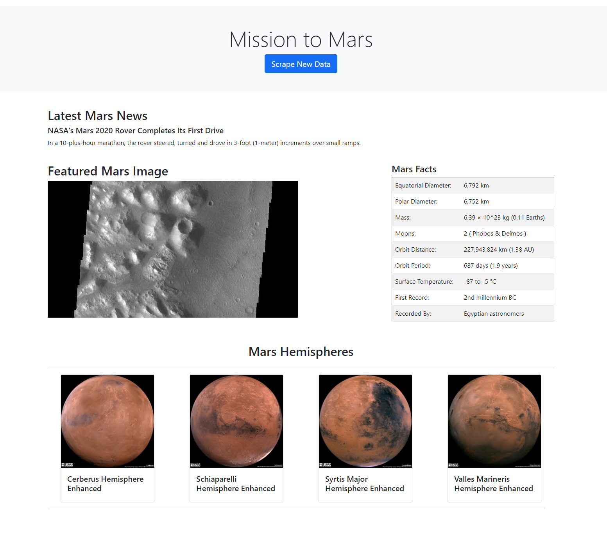
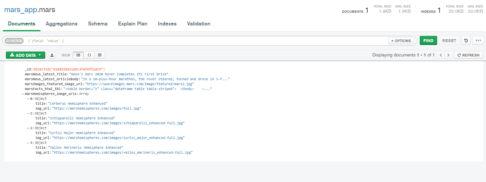

# web-scraping-challenge
Repo for web scraping challenge

The ipynb note book was used for step 1 to work out all the scraping.  Created a python app split accross 2 files along with a seperate html template (index.html located in the templates directory) for formatted rendering.  Run the app.py file and then use the link referenced in the console to load it in a browser.  The scrape_mars.py file contains all the scraping code and is pulled into the app.py file.  Mongo used to persist the scraped data.

The following screen cap is what is rendered when clicking the "Scrape New Data" button.

The following screen cap is what is presisted to Mongo when the scrape occurs.

